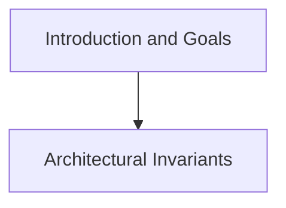

# Introduction and Goals

## Purpose
Requirements overview, quality goals, and stakeholder matrix.

## System Overview & Content
<!-- Detail specific architectural models, context diagrams, or matrices for this chapter below -->

