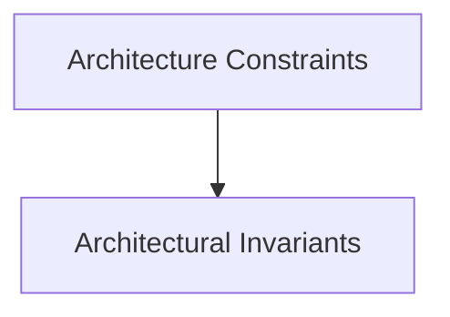

# Architecture Constraints

## Purpose
Technical, organizational, legal, and licensing boundaries.

## System Overview & Content
<!-- Detail specific architectural models, context diagrams, or matrices for this chapter below -->

