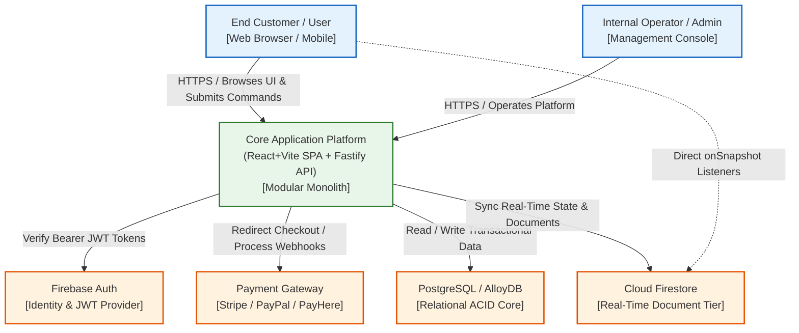

# 03. Context and Scope

## 3.1 Business Context
The system serves end-users, administrative operators, and automated services through secure web interfaces and API endpoints, while integrating with identity providers, payment networks, and cloud storage.

## 3.2 Technical Context & External Interfaces
* **Clients**: Modern desktop and mobile web browsers consuming static SPA assets from Vercel/Firebase Edge CDNs.
* **Identity & Authentication**: Firebase Authentication (issuing secure, cryptographically signed RS256 JWT tokens).
* **Payment Gateways**: Stripe / PayPal / Regional Gateways (PayHere) via asynchronous secure webhooks.
* **Relational Storage**: PostgreSQL / AlloyDB for transactional consistency, ACID guarantees, and complex queries.
* **Document & Sync Storage**: Cloud Firestore for real-time document synchronization and live notifications.

## 3.3 C4 Level 1 System Context Diagram

