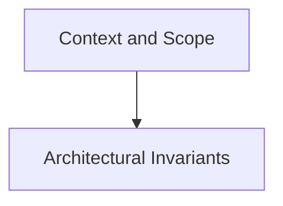

# Context and Scope

## Purpose
Business context and technical system context boundaries (C4 Level 1).

## System Overview & Content
<!-- Detail specific architectural models, context diagrams, or matrices for this chapter below -->

