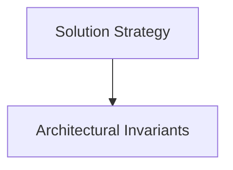

# Solution Strategy

## Purpose
Fundamental decisions, technology stack, patterns, and architectural paradigms.

## System Overview & Content
<!-- Detail specific architectural models, context diagrams, or matrices for this chapter below -->

