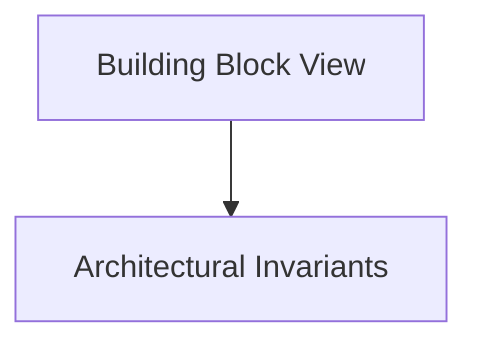

# Building Block View

## Purpose
Static decomposition of the system (C4 Level 2 Container & Level 3 Component views).

## System Overview & Content
<!-- Detail specific architectural models, context diagrams, or matrices for this chapter below -->

