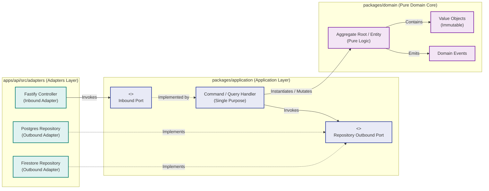

# 05. Building Block View

## 5.1 Level 2: Container Diagram
```mermaid
flowchart TD
    classDef client fill:#f9f9f9,stroke:#333,stroke-width:2px;
    classDef edge fill:#e1f5fe,stroke:#0288d1,stroke-width:2px;
    classDef backend fill:#e8f5e9,stroke:#2e7d32,stroke-width:2px;
    classDef storage fill:#fff3e0,stroke:#e65100,stroke-width:2px;

    ViteApp["React + Vite Client SPA<br/>[TypeScript, TanStack Query]"]:::edge
    FastifyAPI["Fastify API Service<br/>[TypeScript, Zod Validation]"]:::backend
    Firestore[("Cloud Firestore<br/>[Real-Time State & Documents]")]:::storage
    AlloyDB[("PostgreSQL / AlloyDB<br/>[ACID Relational Core]")]:::storage

    ViteApp -->|REST HTTPS (OpenAPI Contract)| FastifyAPI
    ViteApp -.->|Real-time onSnapshot Listeners| Firestore
    FastifyAPI -->|Read / Write Documents| Firestore
    FastifyAPI -->|SQL Queries (Drizzle / Kysely)| AlloyDB
```

## 5.2 Level 3: Component Diagram (Hexagonal Package Layout)

