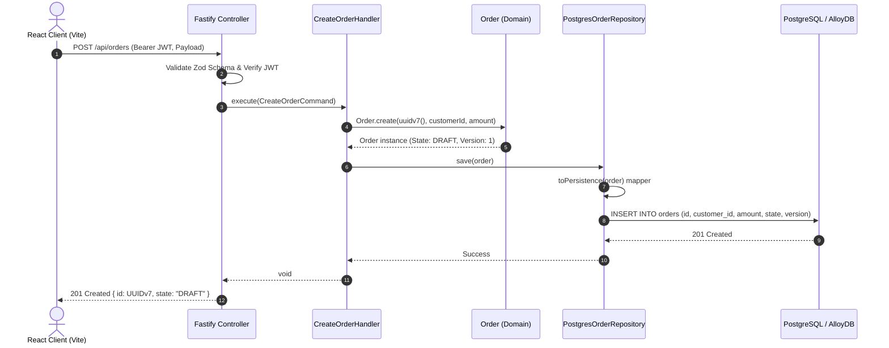
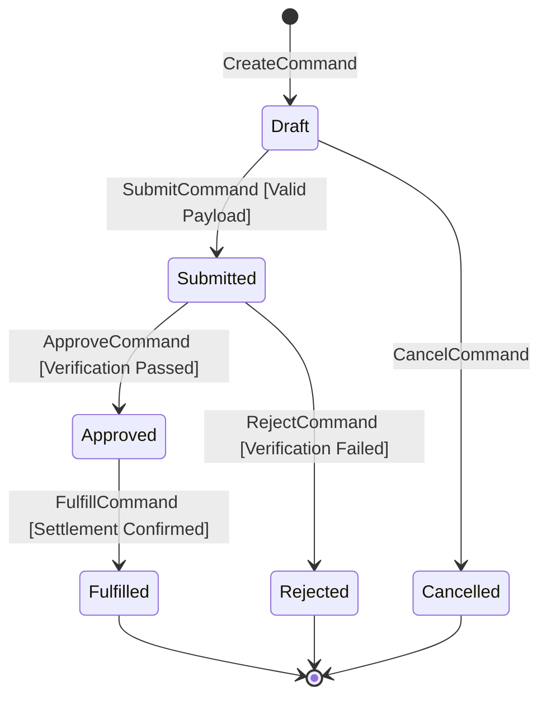

# 06. Runtime View

## 6.1 Command Execution Flow (Order Creation)
The following sequence demonstrates how a command traverses through presentation adapters, application use-case handlers, pure domain entities, and persistence ports:

## 6.2 Real-Time Event Sync via Cloud Firestore
When state mutations occur that need instant client reflection without polling:
1. Fastify completes transactional commit in PostgreSQL/AlloyDB.
2. Fastify updates the corresponding client document in Cloud Firestore.
3. The Vite frontend's active `onSnapshot` listener receives the delta push in < 100ms and updates TanStack Query cache optimistically.

## 6.3 Universal Aggregate Lifecycle State Machine

