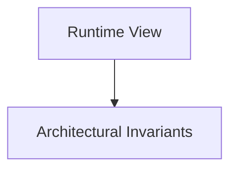

# Runtime View

## Purpose
Dynamic interactions, sequence flows, message events, and state machine lifecycles.

## System Overview & Content
<!-- Detail specific architectural models, context diagrams, or matrices for this chapter below -->

