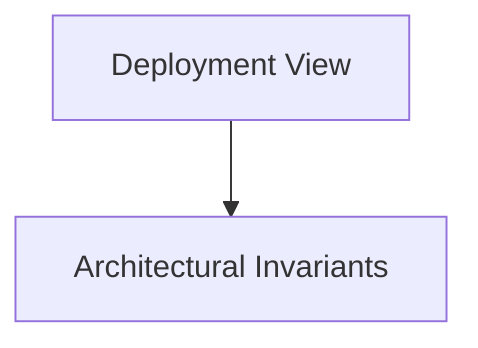

# Deployment View

## Purpose
Infrastructure topology, serverless edge networks, containers, and database tiers.

## System Overview & Content
<!-- Detail specific architectural models, context diagrams, or matrices for this chapter below -->

