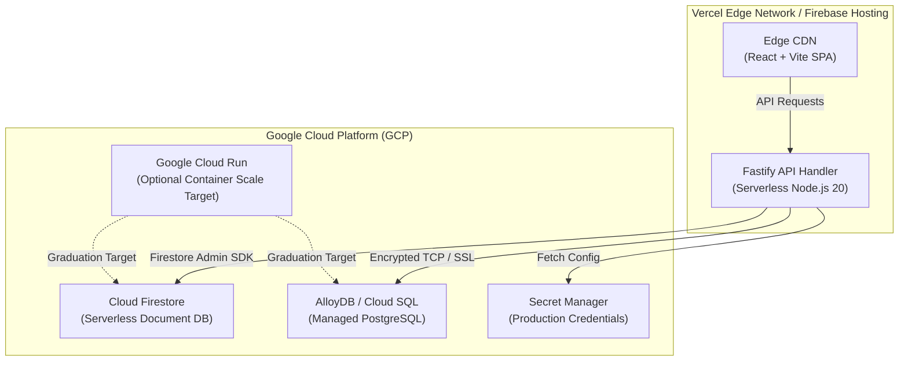

# 07. Deployment View

## 7.1 Infrastructure Deployment Topology
The system leverages a dual-target architecture: running on managed serverless edge infrastructure initially, with containerized scaling triggers.

## 7.2 Zero-Downtime Migration Deployment Strategy
1. **Phase 1 (Expand)**: Run non-destructive SQL migrations (`ADD COLUMN ... NULL`). Old code and new code function simultaneously.
2. **Phase 2 (Deploy)**: Deploy new Fastify backend to Vercel/Cloud Run.
3. **Phase 3 (Contract)**: Execute cleanup migrations (`DROP COLUMN`) only after legacy service instances are completely drained.
