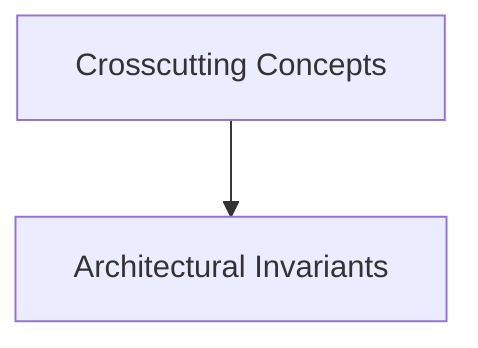

# Crosscutting Concepts

## Purpose
Security, logging, caching, error handling, transaction boundaries, and observability.

## System Overview & Content
<!-- Detail specific architectural models, context diagrams, or matrices for this chapter below -->

