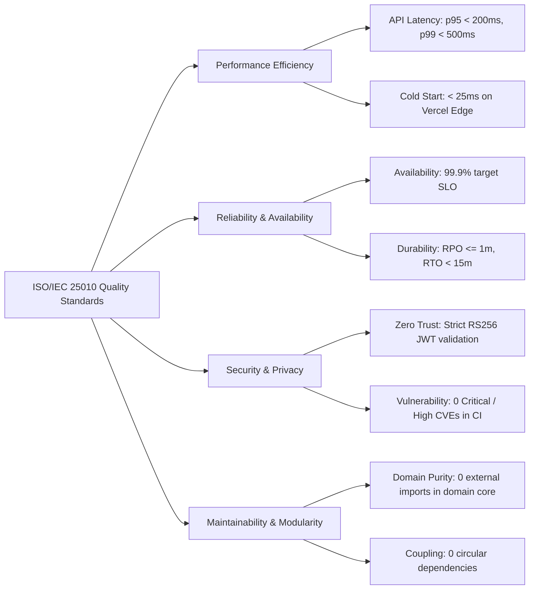

# 10. Quality Requirements

## 10.1 ISO/IEC 25010 Quality Tree

## 10.2 Quality Scenarios & Verification Metrics
1. **QS-1 (Domain Purity)**: If a developer or AI agent imports an ORM or web framework into `packages/domain`, `pnpm run test:architecture` fails in < 5s during CI.
2. **QS-2 (Contract Drift)**: If an API route payload schema changes without updating the OpenAPI specification, contract validation fails in CI.
3. **QS-3 (Zero Downtime)**: Database migrations must run against a live system without locking active tables or causing query failures.
