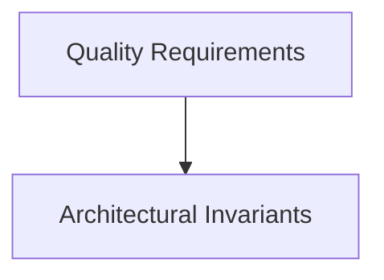

# Quality Requirements

## Purpose
ISO/IEC 25010 Quality Tree with measurable SLOs and acceptance thresholds.

## System Overview & Content
<!-- Detail specific architectural models, context diagrams, or matrices for this chapter below -->

