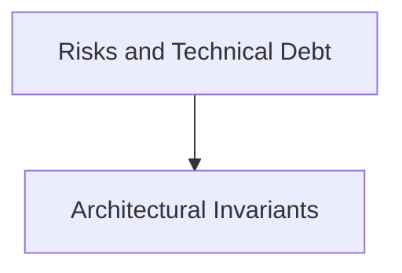

# Risks and Technical Debt

## Purpose
Known risks, operational trade-offs, and managed technical debt items.

## System Overview & Content
<!-- Detail specific architectural models, context diagrams, or matrices for this chapter below -->

