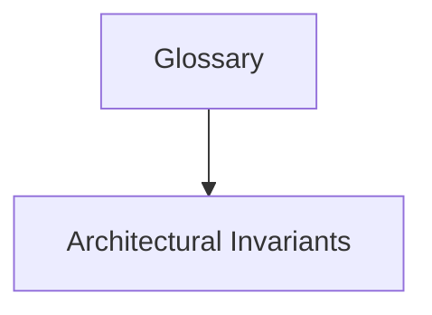

# Glossary

## Purpose
Ubiquitous Language, domain terms, and acronyms dictionary.

## System Overview & Content
<!-- Detail specific architectural models, context diagrams, or matrices for this chapter below -->

