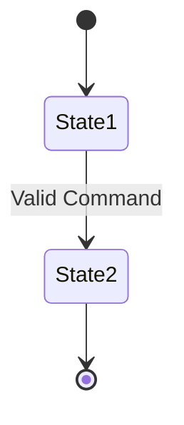

# Feature Specification: [Feature Name]
**Feature ID**: `feat-[id]`  
**Status**: DRAFT | APPROVED | COMPLETED  

## 1. Business Context & Capability
[Brief overview of what capability this introduces]

## 2. Domain Entities & State Invariants
- **Aggregate Root**: [Entity Name] (Primary Key: UUIDv7)
- **Lifecycle States**: [State 1] -> [State 2] -> [State 3]

## 3. Acceptance Scenarios (Given-When-Then)

### Scenario 1: Successful State Transition
- **Given**: An aggregate in state `[State 1]`
- **When**: Receiving command `[CommandName]` with valid payload
- **Then**: State transitions to `[State 2]` and emits domain event `[EventName]`
